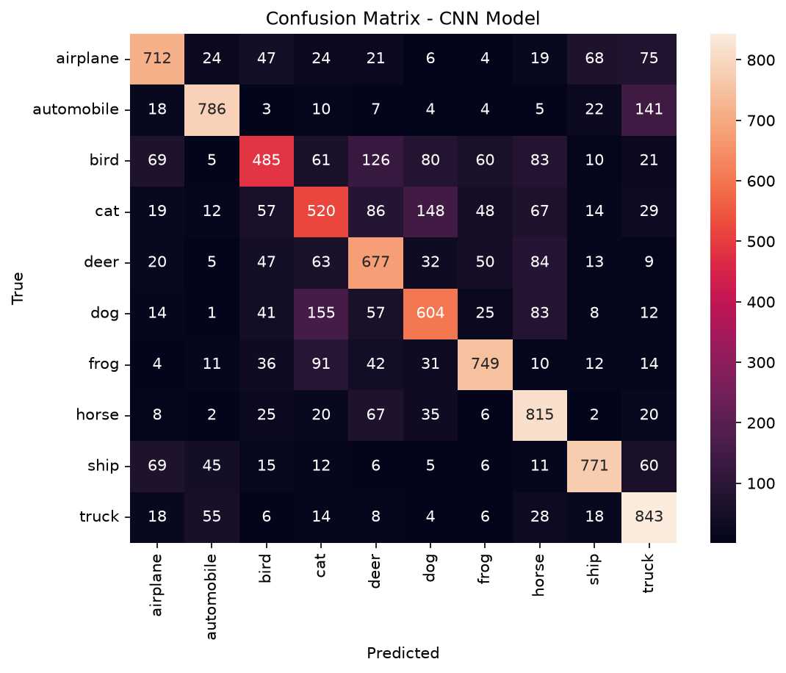
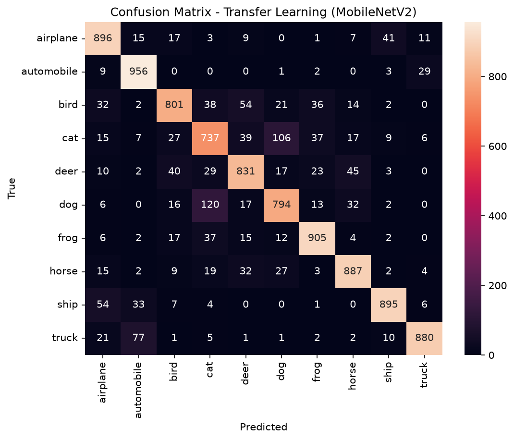

# Image Classification with CNN and Transfer Learning (CIFAR-10)

Comparing a Convolutional Neural Network built from scratch against a transfer learning approach (MobileNetV2) on the CIFAR-10 image classification task.

## Dataset

[CIFAR-10](https://www.cs.toronto.edu/~kriz/cifar.html): 60,000 32×32 color images across 10 classes (airplane, automobile, bird, cat, deer, dog, frog, horse, ship, truck) — 50,000 train / 10,000 test. Loaded via `tensorflow.keras.datasets.cifar10`.

## Approach

### 1. CNN from scratch

```
Input (32,32,3)
→ Conv2D(32, 3x3, relu) → MaxPooling2D
→ Conv2D(64, 3x3, relu) → MaxPooling2D
→ Flatten
→ Dense(64, relu)
→ Dense(10, softmax)
```

- Optimizer: Adam · Loss: sparse categorical crossentropy
- EarlyStopping on `val_loss` (patience=3), 15 epochs max, batch size 64
- Training stopped early around epoch 14; best weights restored from epoch 11 (lowest val_loss, before overfitting set in)

### 2. Transfer Learning (MobileNetV2)

```
MobileNetV2 (frozen, imagenet weights, no top)
→ GlobalAveragePooling2D
→ Dense(10, softmax)
```

- Images resized 32×32 → 96×96 (MobileNetV2's minimum input size) and preprocessed via `mobilenet_v2.preprocess_input`
- Built as a `tf.data.Dataset` pipeline (resize + preprocess on the fly, batched, prefetched) to avoid holding all upscaled images in memory
- Only the classification head is trained; the base model stays frozen
- Optimizer: Adam · EarlyStopping on `val_loss` (patience=3), 5 epochs max

## Results

| Metric | CNN from scratch | Transfer Learning (MobileNetV2) |
|---|---|---|
| Test accuracy | 70% | 86% |
| Trainable parameters | 282,250 | 12,810 |
| Epochs to converge | ~9–11 | 1–3 |
| Weakest classes | cat (0.51), bird (0.57) | cat (0.73), bird (0.83) |

**CNN — confusion matrix**


**Transfer Learning — confusion matrix**


## Conclusions

- Transfer learning reached **85% validation accuracy after just 1 epoch**, already surpassing the scratch CNN's final performance (~70% after 9–11 epochs), while training **~22x fewer parameters** (12,810 vs 282,250).
- Both models struggle most on the same classes — cat, dog, bird, deer — animals with variable poses and overlapping visual features. Vehicle classes (automobile, ship, truck) are the easiest for both, being visually more rigid and distinct.
- Transfer learning's gains are concentrated exactly where the scratch CNN was weakest: the pretrained ImageNet features (edges, textures, shapes) generalize well to the harder, more visually ambiguous classes.
- Trade-off: transfer learning requires upscaling 32×32 images to 96×96, adding preprocessing cost per image, and depends on an external pretrained model rather than learning purely from the target dataset's own feature space.

## Stack

Python · TensorFlow / Keras · scikit-learn · NumPy · matplotlib · seaborn

## Author

Kalil — [github.com/Hazzardbx](https://github.com/Hazzardbx)
Ironhack Data Science & ML Bootcamp, 2026
